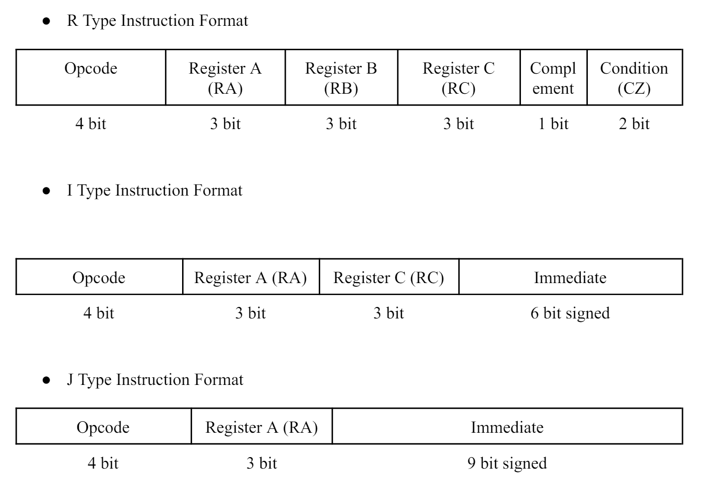
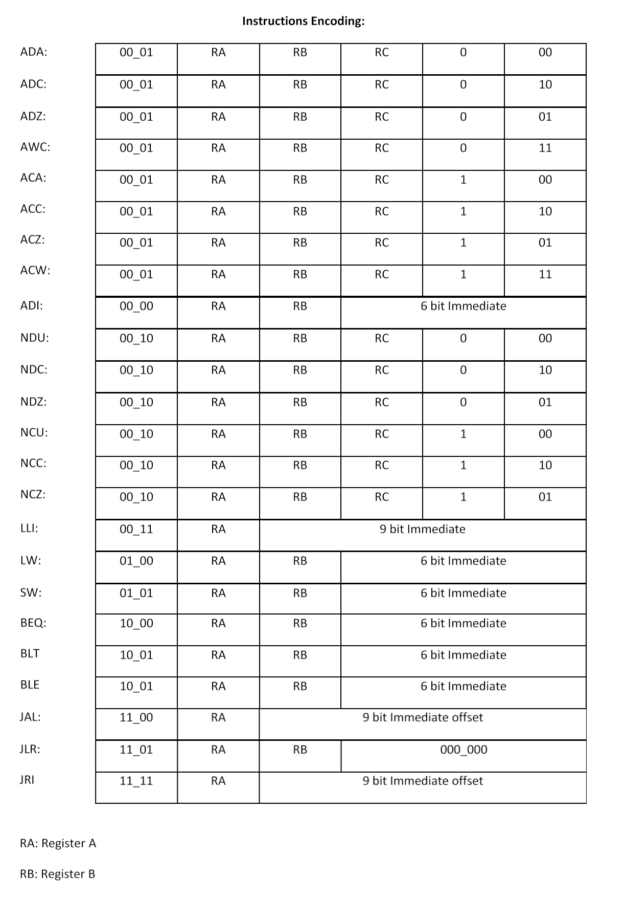
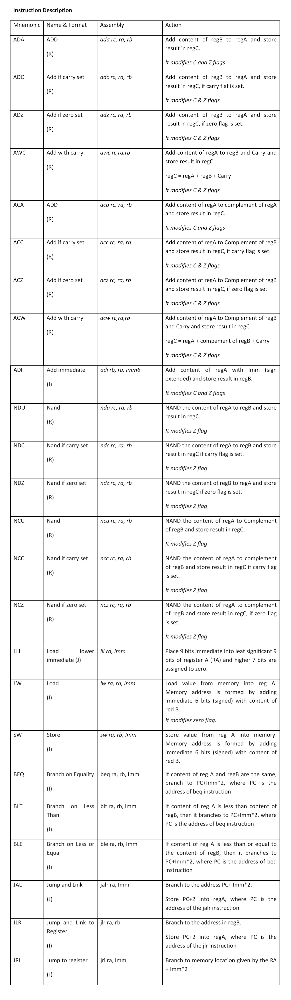

# Pipelined_Processor
This is the design and implementation of a pipelined processor named IITB-RISC. The design is based on the pre-defined instructions and the processor Properties/constraints. The Datapath is designed accordingly and the whole processor is implemented in VHDL.

IITB-RISC is a 6-stage pipelined processor. It is a 16-bit very simple computer that is based on the Little Computer Architecture. It has 8 registers and follows the standard 6 stages of pipeline (Instruction Fetch (IF), Instruction Decode (ID), Register Read (RR), Execute (EX), Memory Access (MEM), and Write Back (WB)). The IITB-RISC is very simple, but it is general enough to solve complex problems. The architecture is optimized for performance, i.e. it includes hazard mitigation techniques.

I have not implemented the Branch Predictor, but it can be easily implemented, and along with a few other minor optimizations, the processor could be improved further.

## Processor Properties
- 16 bit memory and instructions.
- 8 general purpose registers (R0 to R7)
- All addresses are byte addresses and instructions. And it fetches two bytes for instruction and data.
- There are three machine-code instruction formats (R, I, and J type) and a total of  instructions.
- This architecture uses a condition code register which has two flags: Carry flag (C) and Zero flag (Z).

[**Note:** In the Datapath, we have defined the C and Z flags and the output of those flags are defined as CP and ZP which stands for Carry Past and Zero Past. This is defined so that the controller is able to access past flags set by previous instruction. The CC and ZC signals are not stored in the register but the controller is able to read them, then at the next rising edge of the clock cycle, the C and Z registers are updated with CC and ZC.]

## Datapath Design

See the following or refer to the files named "Datapath_IITB_RISC_Pipeline.svg" or "Datapath_IITB_RISC_Pipeline.png".

## Instruction Format

There are three types of instructions: R type (Register), I type (Immediate), J type (Jump).

## Instruction Encoding and Description

See the following or refer to the images named "Instruction_Encoding.png" and "Instruction_Description.png".

